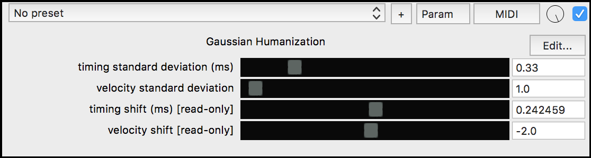

# Gaussian Humanization JSFX

## usage:

This tool is not meant for establishing groove relationships between instruments, you should do that using "Playback time offset" available in a Track's IO window. This tool is for generating subtle variation and life within a set groove position.

## installation:

1. [download](https://raw.githubusercontent.com/benjohnson2001/GaussianHumanization/master/gaussian_humanization) and save the gaussian_humanization file in Reaper's "Effects" folder
2. restart Reaper and add the FX to a track (search for "pandabot" or "gauss")
3. make sure you place it BEFORE a virtual instrument in the FX chain

## technical information:

This tool was made from modifying [schwa's midi_humanizer](https://forum.cockos.com/showthread.php?t=7231). It has the following differences:

  - works on chords!
  - does not drop notes when you have a bunch of contiguous notes in a row
  - input is standard deviation instead of vague "humanization level"
  - does not skew
  - uses Box-Muller algorithm instead of the Central Limit Theorem method
  

You'll notice that some notes are not shifted at all, schwa's midi_humanizer has similar behavior. I'm no JSFX master but as far as I can tell, it works on blocks of data. The way I got this thing to work on chords and contiguous notes was by reaching back in time and adjusting the previous NOTE_OFF positions by the amount that the NOTE_ON positions were shifted. So if you have a bunch of notes with boundaries that touch, this tool will preserve that so there won't be any overlaps or gaps.

However when you get a new block of data you can't reach back in time anymore, so the previous NOTE_OFF position has to stay where it is. Similarly you can only shift within the block, so when you're at the start of the block you can't go any further to the left. You could go to the right, but since you can't extend the previous NOTE_OFF that would create a gap. So this tool doesn't touch notes at the start of a block, to prevent gaps and also to prevent a slight skewing to the right.

You'll also notice that the maximum standard deviation for timing shifts is 1.78, this is to prevent the normal distribution from becoming skewed. I think it depends on Reaper settings, but on my machine I have samplesblock of 512 and samplerate of 48000 so a window is 10.6̅6̅6̅ milliseconds long (the math is samplesblock*1000/samplerate). Therefore if you're in [the middle of the window](https://raw.githubusercontent.com/benjohnson2001/GaussianHumanization/master/histogram.png), the maximum you can go left or right is 5.3̅3̅3̅ ms. If your standard deviation is a third of that, then you have nearly all your values falling in that range. I haven't run tests or anything, but I believe if you increase standard deviation beyond 1.77 ms on my machine then the distribution won't resemble a normal distribution anymore. If your samplesblock and samplerate is different then you might want to adjust it.